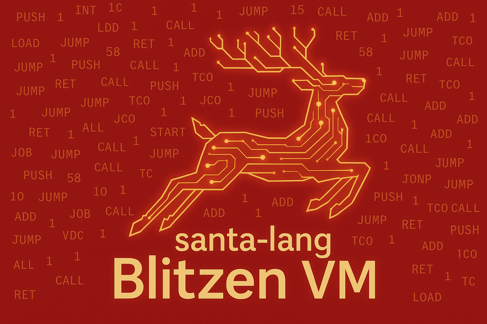

<p align="center"><a href="https://eddmann.com/santa-lang/"></a></p>

# santa-lang Blitzen

Bytecode virtual machine implementation of [santa-lang](https://eddmann.com/santa-lang/), written in Rust.

## Overview

santa-lang is a functional, expression-oriented programming language designed for solving Advent of Code puzzles. This implementation uses a bytecode compilation approach rather than tree-walking interpretation, exploring a different execution model for potential performance improvements.

All santa-lang implementations support the same language features:

- Tail-call optimization (TCO)
- Persistent immutable data structures
- First-class functions and closures
- Lazy sequences and infinite ranges
- Pattern matching with guards
- [70+ built-in functions](https://eddmann.com/santa-lang/builtins/)
- AoC runner with automatic input fetching

## Architecture

```
Source Code → Lexer → Parser → Compiler → Blitzen VM
                                  ↓
                            FrostByte Bytecode
```

| Component      | Description                                         |
| -------------- | --------------------------------------------------- |
| **Lexer**      | Tokenizes source into keywords, operators, literals |
| **Parser**     | Builds an Abstract Syntax Tree (AST)                |
| **Compiler**   | Translates AST to FrostByte bytecode                |
| **Blitzen VM** | Stack-based virtual machine that executes bytecode  |

The **FrostByte** bytecode format includes instructions for stack manipulation, variable access, arithmetic, control flow, collection operations, and function calls.

## Installation

### Docker

```bash
docker pull ghcr.io/eddmann/santa-lang-blitzen:cli-latest
docker run --rm ghcr.io/eddmann/santa-lang-blitzen:cli-latest --help
```

### Release Binaries

Download pre-built binaries from [GitHub Releases](https://github.com/eddmann/santa-lang-blitzen/releases):

| Platform              | Artifact                                       |
| --------------------- | ---------------------------------------------- |
| Linux (x86_64)        | `santa-lang-blitzen-cli-{version}-linux-amd64` |
| Linux (ARM64)         | `santa-lang-blitzen-cli-{version}-linux-arm64` |
| macOS (Intel)         | `santa-lang-blitzen-cli-{version}-macos-amd64` |
| macOS (Apple Silicon) | `santa-lang-blitzen-cli-{version}-macos-arm64` |

## Building

```bash
make release
```

The binary will be at `target/release/santa-cli`.

## Usage

```bash
# Run a solution
make run FILE=examples/aoc2022_day01.santa

# Run tests defined in a solution
make run-test FILE=examples/aoc2022_day01.santa

# Interactive REPL
make repl
```

Or use the CLI directly:

```bash
santa-cli examples/aoc2022_day01.santa
santa-cli -t examples/aoc2022_day01.santa
santa-cli -r
```

## Example

Here's a complete Advent of Code solution (2022 Day 1):

```santa
input: read("aoc://2022/1")

let parse_inventories = split("\n\n") >> map(ints >> sum);

part_one: {
  parse_inventories(input) |> max;
}

part_two: {
  parse_inventories(input)
    |> sort(<)
    |> take(3)
    |> sum;
}

test: {
  input: "1000
2000
3000

4000

5000
6000

7000
8000
9000

10000"
  part_one: 24000
  part_two: 45000
}
```

Key language features shown:

- **`input:`** / **`part_one:`** / **`part_two:`** - AOC runner sections
- **`|>`** - Pipeline operator (thread value through functions)
- **`>>`** - Function composition
- **`test:`** - Inline test cases with expected values

## Development

Run `make help` to see all available targets:

```bash
make help          # Show all targets
make can-release   # Run all CI checks (lint + test)
make lint          # Run rustfmt check and clippy
make fmt           # Format code
make test          # Run all tests
make bench         # Run criterion benchmarks
make test-examples # Run example test suite
```

## Scripts

### Test Runner

Run all example solutions in test mode:

```bash
make test-examples
# or directly:
./examples/run-tests.sh
```

**Options:**

| Flag                    | Description                     |
| ----------------------- | ------------------------------- |
| `-i, --include PATTERN` | Only run tests matching pattern |
| `-e, --exclude PATTERN` | Skip tests matching pattern     |
| `-t, --timeout SECONDS` | Per-test timeout (default: 60)  |

**Examples:**

```bash
# Run only 2022 tests
./examples/run-tests.sh -i 'aoc2022_*'

# Skip slow tests
./examples/run-tests.sh -e 'aoc2022_day19' -e 'aoc2022_day16'

# Run a specific day
./examples/run-tests.sh -i 'aoc2022_day01'
```

### Benchmark Script

Compare Blitzen VM performance against another santa-cli binary:

```bash
./examples/benchmark-2022.sh /path/to/baseline/santa-cli
```

**Requirements:** [hyperfine](https://github.com/sharkdp/hyperfine) (`brew install hyperfine`)

**Options:**

| Flag                    | Description                               |
| ----------------------- | ----------------------------------------- |
| `-w, --warmup N`        | Warmup runs before measuring (default: 5) |
| `-r, --runs N`          | Number of benchmark runs (default: 20)    |
| `-i, --ignore-failures` | Continue benchmarking on failures         |

**Examples:**

```bash
# Compare against reference implementation
./examples/benchmark-2022.sh ~/santa-lang-rs/target/release/santa-cli

# Quick benchmark with fewer runs
./examples/benchmark-2022.sh /path/to/baseline -w 2 -r 5
```

Results are saved to `benchmark-results/` as markdown tables.

### Criterion Benchmarks

Run micro-benchmarks for VM components:

```bash
make bench
```

HTML reports are generated in `target/criterion/`.

## Project Structure

```
├── lang/                   # Core language library
│   └── src/
│       ├── lexer/          # Tokenization
│       ├── parser/         # AST construction
│       ├── vm/             # Compiler, bytecode, runtime
│       └── runner/         # AOC runner support
├── runtime/cli/            # Command-line interface
├── examples/               # AOC solutions (.santa files)
└── benchmarks/             # Criterion benchmarks
```

## See Also

- [eddmann/santa-lang](https://github.com/eddmann/santa-lang) - Language specification/documentation
- [eddmann/santa-lang-editor](https://github.com/eddmann/santa-lang-editor) - Web-based editor
- [eddmann/santa-lang-ts](https://github.com/eddmann/santa-lang-ts) - Tree-walking interpreter in TypeScript (Prancer)
- [eddmann/santa-lang-rs](https://github.com/eddmann/santa-lang-rs) - Tree-walking interpreter in Rust (Comet)
- [eddmann/santa-lang-blitzen](https://github.com/eddmann/santa-lang-blitzen) - Bytecode VM in Rust (Blitzen)
